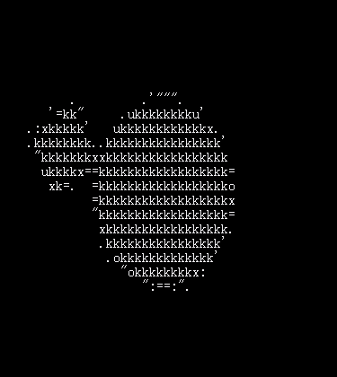

# pic2ascii

 - [English](./README.md)
 - [简体中文](./README_cn.md)
 
## 需求

Go 版本 >= 1.5.

## 下载与安装

``` shell
go get -u -v github.com/wzshiming/pic2ascii/cmd/pic2ascii
```

## 用法

### 示例1

``` shell
pic2ascii -f ./demo/src.gif -w 80 -h 40 -r
```
或
``` shell
docker run --rm -it wzshiming/pic2ascii pic2ascii -f https://github.com/wzshiming/pic2ascii/blob/master/demo/src.gif?raw=true -w 80 -h 40 -r -t gif
```




### 示例2

``` shell
pic2ascii -c "MMWNXK0Okxou=:\"'.  " -f https://avatars0.githubusercontent.com/u/6565744 -w 90 -h 40
```
或
``` shell
docker run --rm -it wzshiming/pic2ascii pic2ascii -c "MMWNXK0Okxou=:\"'.  " -f https://avatars0.githubusercontent.com/u/6565744 -w 90 -h 40
```

[](https://github.com/wzshiming)
``` log
  ..  .
kx=::'
MMMMMNo.
MMMMMMMXu
MMMMMMMMMx'
MMMMMMMMMMMXk="..
MMMMMMMMMMMMMMMMXo'
MMMMMMMMMMMMMMMMMMWKko=".                                                             ..':
MMMMMMMMMMMMMMMMMMMMMMMMWK=..                                                    . .uk0NWM
MMMMMMMMMMMMMMMMMMMMMMMMMMMXku"  .                                            '"u0XWMMWMMM
MMMMMMMMMMMMMMMMMMMMMMMMMMMMMMMNKOo".    ..                               .=kXWMMMMMMNNNWM
MMMMMMMMMMMMMMMMMMMMMMMMMMMMMMMMMMMMW0ko:''.                         .':x0NMMMMMMMMMMMMMMM
MMMMMMMMMMMMMMMMMMMMMMMMMMMMMMMMMMMMMMMMMMMW0x=:'..              ."u0WMMMMMMMMMMMMMNkooOWM
MMMMMMMMMMMMMMMMMMMMMMMMMMMMMMMMMMMMMMMMMMMMMMMMMWNXK0Okou==:":uxXMMMMMMMMMMMMMWk:''   .xM
MMMMMMMMMMMMMMMMMMMMMMMMMMMMMMMMMMMMMMMMMMMMMMMMMMMMMMMMMMMMMMMMMMMMMMWMMMMMMWk" .     .oM
MMMMMMMMMMMMMMMMMMMMMMMMMMMMMMMMMMMMMMMMMMMMMMMMMMMMMMMMMMMMMMMMMMMMMMMMMMMKu' .       'XM
MMMMMMMMMMMMMMMMMMMMMMMMMMMMMMMMMMMMMMMMMMMMMMMMMMMMMMMMMMMMMM=""kMMMMMMMMN..     .    oMM
MMMMMMMMMMMMMMMMMMNXXK00Okkouooooxk0NMMMMMMMMMMMMMMMMMMMMWXko"   'KMMMMMMMk.          'KMM
MMMMMMMMMMMWNKOo:'.         .     . .=kXMMMMMMMMMMMMMNKk:..      :XMMMMMMMO .        'OMMM
MMMMMMNKx"'.....                        '=kNMMWKOxu:'            'OMMMMMMMX.        .uWMMM
MMXk='.  ...=ONNK'                      .  "NMO .                 :KMMMMMMN"     .=xXMMMMM
=".      "okkuOMM0.           ..."=xx='   . oMW=.                  =WMMMMMW:    'KMMMMMMMM
        "XK"..uMMM"          ..xKN0o0M0"    .OMX".                 :NMMMMMM"  . "MMMMMMMMN
       .x:. . kMMMk.       .=0Ku"..uMMM0'.   "NMk.                 "NMMMMMW'  . .oONMMMXx'
    . .o0. .. :NMMx   .   .x0=..  'XMMMN".    kMW=                 :XMMMMMX'      ..:=='
  .  .:0:  . '=WMW"       .=. . ..oMMMNu.    ."MMO.                .kMMMMM0.      .
           .  "==' ..   .    .   .kNWO"    .  'NMN"              . "0MMMMMX
            .:". .===:""'.     '  ..'         .OMW:              .xNMMMMMNu..
          .:u:'  'xO0KKK00k:  .o"             .oWM:            .'OMMMMMMK:.
         'uu"""""::::::"""'.  .ou..           .xMM:           'oXMMMMMMX'
        .uo"0kuooooxxkkO00X0ku":O:            .OMW:           OMMMMMMMW:  .
        .uo'uXKkx=::"""":==o00o=x=.          ."NMX.       . "kMMMMMMMx'
         =x''oXMMMMMMMMMMMMK=.'o='.           xMMo         =NMMMMMMXu.
         .==  .=oxkO000Okx:.':u..           .oWMX:     . "xWMMMMMK=..
.                 .    . ..=:' .            kMMO..     .xMMMMMMXu
0o.                       ''            ."uKMXo.     .=0MMMMMMx'
MMKu.                                 ."kWMNx' .     =WMMMMNk:..
":".                                  ."xo:'         :xkkkx:.
                                       .
       ..         ..      ..       ...

```

## 许可证

软包根据MIT License。有关完整的许可证文本，请参阅[LICENSE](./LICENSE)。

  

